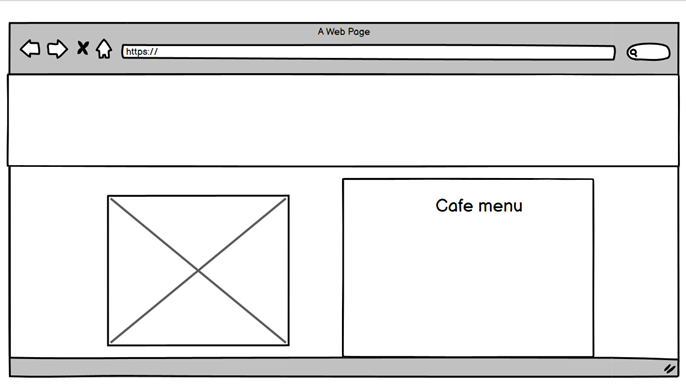

<header><h2>Project one</h2>
<h1>Bundle and Coffee: Guiena Pig Cafe</h1>
<h2>Lydia Young</h2><header>
 

<h2>Project Demo Page</h2>

 
<h2>Project Brief</h2>
 
Bundle and Coffee is a cosy cafe which is the home to Guinea pigs. This cafe is designed for those who love pets, especially Guinea pigs. The Guinea pig cafe is located in Hackney which is a London borough full of families who might not have the space in their flats to have pets at home.  
This cafe makes it possible for families or individuals to come and play with the Guinea pigs without the responsibility or commitment!
The website will allow you to make enquiries, book a play session with the Guinea pigs, meet the pets and browse the menu. 
 
<h2>User Experience</h2>
 
<h3>Project outcomes</h3>
 
<li>To desgin a website for a Guiena pig cafe</li>
<li>To create a good experience for the user when browsing the webpage and make all the pages clear and easy to find.</li>
<li>To design a website that isn't confusing for users and gives them all the information they need.</li>
 
<h3>User Stories</h3>
 
<li>I need a website that we help me find a local cafe with the correct location and information on opening times. Preferably this will be on a home page so that It is easy to find</li>
<li>I am looking for a cafe website where the information is clear and the design looks good.</li>
<li>I am a website user and I need to be able to read a website that is accessible.</li>
 
<h2>Features</h2>
<ul>
<li>Navigation links to the other website pages</li>
<li>Logo</li>
<li>Booking enquiry form with submission button and link to page</li>
<li>Home page</li>
<li>Menu Page</li>
<li>Gallery Page</li>
<li>Footer with social media links</li>
</ul>
 
<h2>Structure Plan</h2>

All pages will have a banner with a nagation bar which not only links to the other pages, but displays the logo. The home page will have the cafe title 'Bundle & Coffee". All pages will contain the colors listed in my design and color scheme section. All pages will contain a footer with socail media links, contact information and copy right information. In my disign plan, the banner was going to be pink but I changed it for two reasons. Firstly because the contrast between the font color and the background color was not strong enough, and secondly because I thought the beans image would help users to know that it was a cafe website. 
The home page will display a landing photo of a guiena pig, a picture of the cafe, a booking form, a description of what the cafe is and information on the opening times and address. 
The Gallery page will display pictures and descriptions of all the guiena pigs in the body, and the banner, nav bar, logo and footer. 
The menu page will display the cafe menu and an image of the cafe as well as the banner, nave bar, logo and footer.

<h2>Wireframes plans</h2>

 

 
<h2>Design and Color scheme</h2>

For the color scheme I wanted some browns and oranges as because that would match the colors of the Guiena pigs themselves as one is ginger, and the browns would work alongside a coffee bean image.
  I then wanted to add some pink colors to add to the playfulness of the cafe, and to stand out and compliment the browns and oranges. 
For the logo I want to use some of these colors, so that the color scheme runs throughout. 
I picked a dark grey for the text so that I was a good contrast from the background.

 
<h2>Frame works and Libraries</h2>
<ul>
<li>HTML</li>
<li>CSS</li>
<li>Google Fonts</li>
<li>Canva</li>
<li>Pexels</li>
<li>Wireframes</li>
<li>Paint application</li>
</ul>
 
<h2>Testing</h2>
<h3>Strategy</h3>

All pages must pass through the W3C HTML code validator

Whilst annaylising the web page on dev tools, all passes must score over 90 in performance, accessiblity, SEO and best practices.

The CSS style sheet must pass through the W3C validator and show no errors.

The website will also be tested locally when deployed.

<h3>Summary</h3>
This is a static website with HTML and CSS but no back-end functionality. Therefore, the testing will have a focus on the performance, accessibility and the layout of the website. 
The website layout on each page should be the banner, the body and the footer without overlapping containers. All images should load quickly for the best user experience. The booking form on the home page should open a confirmation message on a new page. The navigation bar should link to other pages on the website and the font should change color depending on the page being active or visited. 
The website should be accessible with alt tags on images, links and forms so that users with impairments are able to know what the content is showing. 
The webpage should be responsive, and the contents should wrap to best fit the screen size. I have used media queries for iPad and mobile phone screen sizes. The banner and footer width should shrink to fit the content as well as the font sizes. 

<h2>Testing Results</h2>
 

 

Other issues found whilst testing:

1.  	List element should be wrapped in a ul or ol tag.
 Action: I have now added a ul element to the social media links in the footer.
2.  	Document does not have a meta description.
Action: I have now added a meta description.
3.  	Navigation links and the booking form items did not have a correct amount of space in between which would make a poor user experience as the user may accidentally click the wrong item.
Action: Add the gap property in between the nav bar items and add margins to the booking form items and send button. 
4. Upon doing a peer review, my classmate suggested that the margins for booking forms should be larger on a mobile screen and the images should be slightly smaller for a better user experience. 
Action: I have used this suggestions and added margins and made the images smaller for mobile devices. 
5. The footer did not fill the page width. 
Action: I changed the width to 100% to match the banner, but I still ran into the same issues. 
I then changed the footer width to 1360px in devtools and that worked but the footer is now not responsive. 
Action: Change the footer width across screen sizes. 
This did not work and I ran into the same issues, so I will revert back to using using 100% as the max width. 
 
<h3>W3C Validator results</h3>
Index.html:

There were a few errors listed when I ran my code so I have listed my actions below:

Remove line break before footer. 
Remove aria-labelledby property from image. 
Edit aria-labelledby tags in navagation bar links to aria-label

A body start tag was found in the submit.html page but the element was already open. Action: Move body start tag to before header.

<a href="https://docs.google.com/document/d/1nFfqbd-5FjWe_yTLlFebqb_IEbXeEUhVzSRfRjbDuL4/edit">You can veiw my testing results here</a>

<h2>Credits</h2>

I have listed the sources used below to credit their content in my webpage.
 
Webites use for extra help or information on coding:
<li>w3schools.com</li>
<li>https://stackoverflow.com/</li>
<li>https://css-tricks.com/snippets/css/a-guide-to-flexbox/</li>
<li>https://code-boxx.com/display-message-after-submitt-html-form/</li>
<li>https://blog.hubspot.com/website/resize-image-without-losing-quality#ms-paint</li>
<li>https://developer.mozilla.org/en-US/docs/Web/HTML/Element/input/submit#formenctype</li>
<li>https://www.aditus.io/aria/aria-label/</li>

For help in contrusting the readme file

<li>https://github.com/Daisy-McG/MilestoneProject-1#Testing</li>
 
Images:
 
Some of the images are my own taken of my pet guiena pigs. Other credits are listed below.
 
https://www.pexels.com/photo/brown-coffee-beans-942809/ 
 
Café image:
 
https://www.pexels.com/photo/child-outside-building-near-wooden-furniture-and-tree-756093/
 
menu page:
 
https://www.pexels.com/photo/coffee-cups-in-cafe-16180909/

<h2>Deployment</h2>

I started this project by using the code insitute template and clicking 'use this template'. I called the repository Bundle-and-coffee.

I used these commands in the terminal window:

<ul>
<li>git add . to add a new change to the main branch</li>
<li>git commit -m and a message explaining the updates to commit issues to the local repository.</li>
<li>git push was used to push all changes to the main branch.</li>
</ul>

<h2>Run Locally</h2>
1. Go to the GitHub repository. 
2. Click on settings. 
3. Under code and automation in the side menu, click pages. 
4. Under the Build and Deployment section, Click to deploy from the main branch and save. 
5. Your project is now live.

<h2>Credits</h2>
<h3>Content</h3>

The contents of this website was written by Lydia Young.

<h3>Acknowledgemnts</h3>

Thank you to my mentor Ronan for all his guidence and helpful resources. Thank you too to my fellow classmate Vas for helping me with flexbox and margins.

 I would also like to give a special thanks to past student Harry for helping me to debug using the developer tools and for helping me to understand file path routes.
